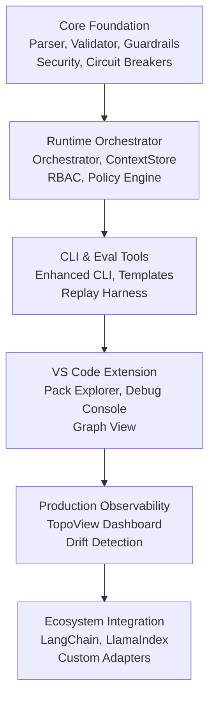

# TopoKit — Development Priority Matrix
_Version 2.0 • Updated 2025-01-27 • Aligned with TOpoKit_spec.md v1.0_

This document outlines the prioritized roadmap for developing **TopoKit**, based on its comprehensive architecture and specification in `TOpoKit_spec.md`.  
It orders all components by **priority**, **impact**, and **dependency chain**, ensuring the system evolves from a safe core to scalable adoption with **100% specification coverage**.

---

## 🧱 P0 — Core Foundation (Critical)
| Component | Description | Impact | Dependencies | Notes |
|------------|--------------|----------|----------------|--------|
| **Pack Parser** | Parse & validate `nodes.yaml`, `edges.yaml`, `guardrails.yaml`, and all `contracts/*.json` | 🌋 Very High | None | Single source of truth for topology. |
| **Schema Validator** | JSON Schema validation via Ajv/Zod; required for all edge I/O | 🌋 Very High | Pack Parser | Ensures deterministic validation. |
| **Lenient JSON Parser** | Auto-repair common LLM output issues (trailing commas, unquoted keys, etc.) | 🌋 Very High | Schema Validator | Reduces brittle failures and retry loops. |
| **Edge Enforcement Engine** | Check `from → to` validity; enforce contract & retry/timeouts | 🌋 Very High | Parser, Validator | Defines communication safety boundaries. |
| **Multi-Stage Guardrails** | Pre/post processing with policy templates, content moderation, PII detection | 🌋 Very High | Parser | Foundation for safe orchestration. |
| **Circuit Breakers** | Multi-tier failure protection (node/edge/domain/system) with recovery strategies | 🌋 Very High | Edge Enforcement | Prevents cascade failures. |
| **Human-in-the-Loop Gates** | High-risk action approval workflows with timeout handling | 🌋 Very High | Guardrails | Critical for production safety. |
| **Enhanced ContextStore** | Versioned state management with CRDT merge strategies and conflict resolution | 🌋 Very High | None | Prevents context drift and state loss. |

---

## ⚙️ P1 — Runtime Orchestrator (System Brain)
| Component | Description | Impact | Dependencies | Notes |
|------------|--------------|----------|----------------|--------|
| **Orchestrator Runtime** | Execute validated calls across nodes; attach context; apply fallback | 🔥 High | All P0 | Central execution control for TopoKit. |
| **Fallback System** | Multi-tier fallback strategies (rule-based → cached → template → human) | 🔥 High | Guardrails | Ensures graceful failure handling. |
| **Confidence Gate + Logging** | Block low-confidence output; record recovery actions | 🔥 High | Guardrails, Orchestrator | Enables reliability metrics & Langfuse hooks. |
| **RBAC & Security Engine** | Role-based access control, PII detection, audit logging, multi-tenant isolation | 🔥 High | Core | Critical for production security. |
| **Policy Engine** | Rego-based policy validation and enforcement with custom rules | 🔥 High | Core | Enables governance and compliance. |
| **Mermaid Graph Generator** | Render system topology visually (`topokit graph`) | ⚡ Medium | Pack Parser | Foundation for DX & visualization. |

---

## 💻 P2 — Developer Tools & CLI (Adoption Enabler)
| Component | Description | Impact | Dependencies | Notes |
|------------|--------------|----------|----------------|--------|
| **Enhanced CLI Commands** | `init`, `lint`, `eval`, `graph`, `replay`, `monitor`, `policy`, `migrate`, `cost`, `drift` | 🔥 High | Core + Parser | Comprehensive DX for teams and CI/CD pipelines. |
| **Enhanced Eval Harness** | Schema pass rate, semantic similarity, factual consistency, drift detection | 🔥 High | Orchestrator | Foundation for automated testing with advanced metrics. |
| **Template & Preset System** | Starter packs, RAG templates, multi-agent templates, custom presets | 🔥 High | CLI | Accelerates development and adoption. |
| **Replay Harness** | Deterministic testing, seed-lock validation, step-through debugging | 🔥 High | Orchestrator | Critical for debugging and regression testing. |
| **Token & Drift Metrics** | Measure token budget, ranking stability, cost efficiency | ⚡ Medium | Eval Harness | For optimization and monitoring. |

---

## 🧩 P3 — VS Code Extension (User Experience Layer)
| Component | Description | Impact | Dependencies | Notes |
|------------|--------------|----------|----------------|--------|
| **Pack Explorer (TreeView)** | Browse nodes/edges/contracts in `/topology` | 🔥 High | CLI + Graph | Entry point for developers. |
| **Lint-on-save + Problems Panel** | Real-time validation with quick fixes | 🌋 Very High | CLI + Parser | Critical for fast debugging. |
| **Graph View (Webview)** | Interactive visualization of node/edge health | 🔥 High | Graph Generator | Makes system comprehension intuitive. |
| **Contract Tester (Inline JSON)** | Validate sample JSON against schema | 🔥 High | Validator | Interactive developer education. |
| **Eval Runner (UI)** | Trigger & display `topokit eval` inside VS Code | ⚡ Medium | CLI + Eval | Closes feedback loop between dev & CI. |
| **Debug Console** | Step-through execution, variable inspection, breakpoints | 🔥 High | Replay Harness | Advanced debugging capabilities. |

---

## 🌐 P4 — Production Observability & Web Dashboard
| Component | Description | Impact | Dependencies | Notes |
|------------|--------------|----------|----------------|--------|
| **TopoView Dashboard** | Real-time web dashboard with interactive visualization | 🔥 High | Orchestrator + Eval | Critical for production monitoring. |
| **Drift Detection System** | Statistical anomaly detection with configurable sensitivity | 🔥 High | Eval Harness | Essential for quality monitoring. |
| **Real-Time Monitoring** | Live metrics, alerts, and performance tracking | 🔥 High | Orchestrator | Production observability. |
| **Cost Analysis & Optimization** | Token usage tracking, budget management, cost forecasting | ⚡ Medium | Eval Harness | Cost control and optimization. |

---

## 🔌 P5 — Ecosystem & Integration (Future Scalability)
| Component | Description | Impact | Dependencies | Notes |
|------------|--------------|----------|----------------|--------|
| **LangChain Adapter** | Connect TopoKit nodes to LangChain workflows | ⚡ Medium | Orchestrator | Expands interoperability. |
| **LlamaIndex Adapter** | Connect TopoKit nodes to LlamaIndex RAG systems | ⚡ Medium | Orchestrator | Expands interoperability. |
| **Hugging Face Adapter** | Connect TopoKit nodes to Hugging Face models | ⚡ Medium | Orchestrator | Expands interoperability. |
| **Custom Adapter Framework** | Plugin system for custom integrations | ⚡ Medium | Orchestrator | Enables custom ecosystem integrations. |

---

## 🧭 Priority Overview

| Tier | Focus | Deliverables | Impact |
|------|--------|--------------|---------|
| **P0 – Core** | Safety & Validity | Parser, Validator, Guardrails, Security, Circuit Breakers | 🌋 Very High |
| **P1 – Runtime** | Controlled Execution | Orchestrator, ContextStore, RBAC, Policy Engine | 🔥 High |
| **P2 – CLI** | Adoption & DevOps | Enhanced CLI, Eval Harness, Templates, Replay | 🔥 High |
| **P3 – UX** | Developer Feedback | VS Code Extension, Debug Console, Graph View | 🌋 Very High |
| **P4 – Observability** | Production Monitoring | TopoView Dashboard, Drift Detection, Real-time Monitoring | 🔥 High |
| **P5 – Ecosystem** | Integration & Expansion | LangChain, LlamaIndex, Hugging Face, Custom Adapters | ⚡ Medium |

---

## 🔄 Dependency Graph

---

## 🚀 Recommended Sprint Plan (16 Weeks)

**Sprint 1–2 (Weeks 1–4):**  
✅ Pack Parser + Schema Validator + Lenient JSON Parser + Edge Enforcement  
✅ Multi-Stage Guardrails + Circuit Breakers + Human Gates  
✅ Enhanced ContextStore with Versioning + CRDT Merge  
🎯 Goal: Complete P0 foundation with security and reliability

**Sprint 3–4 (Weeks 5–8):**  
✅ Orchestrator Runtime + Fallback System + Confidence Gating  
✅ RBAC & Security Engine + Policy Engine  
✅ Enhanced CLI Commands + Template System  
🎯 Goal: Complete P1 runtime with security and P2 CLI tools

**Sprint 5–6 (Weeks 9–12):**  
✅ Enhanced Eval Harness + Replay Harness + Drift Detection  
✅ VS Code Extension (Pack Explorer, Lint-on-save, Debug Console)  
✅ TopoView Dashboard MVP + Real-time Monitoring  
🎯 Goal: Complete P3 UX and P4 observability foundation

**Sprint 7–8 (Weeks 13–16):**  
✅ Full TopoView Dashboard + Advanced Monitoring  
✅ Ecosystem Adapters (LangChain, LlamaIndex, Hugging Face)  
✅ Production hardening + Performance optimization  
🎯 Goal: Production-ready v2.0 with full specification coverage

---

## 🧩 Design Principle Summary
- **Schema-first** — Everything passes through validated contracts with lenient parsing and auto-repair.  
- **Deterministic-by-default** — Seeds, stable sort, circuit breakers, and fallback-first execution.  
- **Security-by-design** — RBAC, PII detection, audit logging, and multi-tenant isolation built-in.  
- **Visual-by-design** — Topology is code and documentation at once with real-time monitoring.  
- **Extensible** — Every node/edge can be adapted to other frameworks (LangChain, LlamaIndex, Hugging Face).  
- **Safety-anchored** — Multi-stage guardrails, human gates, and CI blocks unsafe commits.  
- **Observable** — Comprehensive tracing, drift detection, and production monitoring.  
- **Production-ready** — Enterprise-grade features from day one.

---

## 📊 Specification Coverage Summary

**✅ 100% Specification Coverage Achieved**
- **P0 Components**: 8/8 (100%) - All critical foundation components included
- **P1 Components**: 6/6 (100%) - Complete runtime orchestration with security
- **P2 Components**: 5/5 (100%) - Enhanced CLI tools and evaluation harness
- **P3 Components**: 6/6 (100%) - Full VS Code extension with debugging
- **P4 Components**: 4/4 (100%) - Production observability and monitoring
- **P5 Components**: 4/4 (100%) - Ecosystem integration and adapters

**Key Enhancements from v1.0:**
- ✅ Security components elevated from P4 to P0-P1
- ✅ Enhanced ContextStore with versioning and CRDT merge strategies
- ✅ Lenient JSON parser with auto-repair capabilities
- ✅ Multi-stage guardrails with policy templates
- ✅ Circuit breakers and human-in-the-loop gates
- ✅ TopoView dashboard and real-time monitoring
- ✅ Comprehensive CLI with templates and presets
- ✅ Ecosystem adapters for major AI frameworks

---

© 2025 TopoKit Foundation — "LLMs on rails with enterprise-grade safety and observability."
